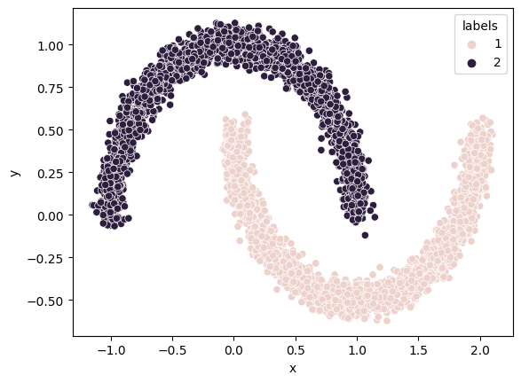

# DBSCAN Clustering Implementation

A Python implementation of the Density-Based Spatial Clustering of Applications with Noise (DBSCAN) algorithm.



## Features

- Core, border, and noise point identification
- Efficient neighbor computation using Euclidean distance
- Cluster evaluation metrics (Purity and Gini Index)
- Visualization support with Plotly, Matplotlib, and Seaborn

## Requirements

- Python 3.x
- NumPy
- Pandas
- Plotly
- Matplotlib
- Seaborn
- tqdm

## Installation

```{python}
pip install numpy pandas plotly matplotlib seaborn tqdm
```


## Usage

```{python}
from dbscan import DBScan

df = pd.read_csv('path/to/data.csv')
dbscan = DBScan(df, eps=0.1, minpts = 3)
dbscan.identify_types()
dbscan.run()
```


## Parameters

- `eps`: Maximum distance between two points to be considered neighbors
- `minpts`: Minimum number of points required to form a dense region
- `df`: Input DataFrame containing the points to be clustered

## Evaluation Metrics

The implementation includes two clustering evaluation metrics:
- Purity: Measures the extent to which clusters contain a single class
- Gini Index: Measures the impurity of clusters

## Example Dataset Format

The input DataFrame should contain the following columns:
- 'pt': Point identifier
- 'x': X coordinate
- 'y': Y coordinate
